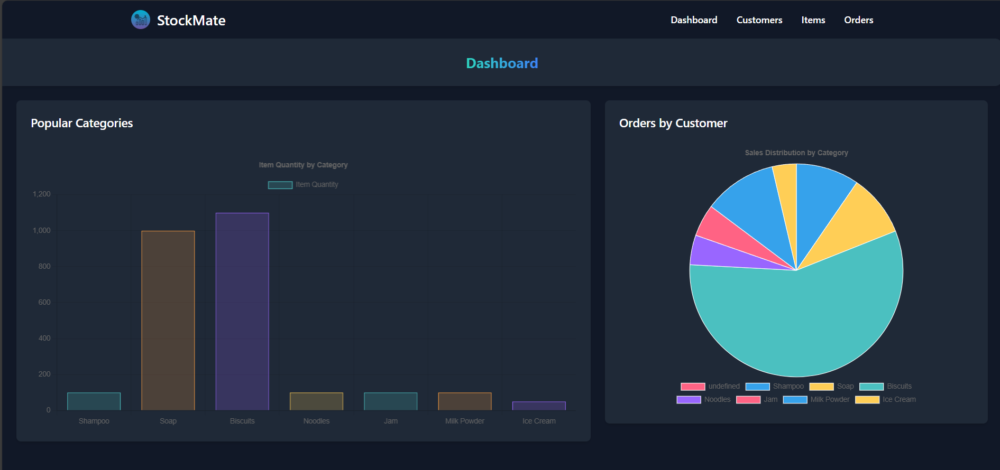
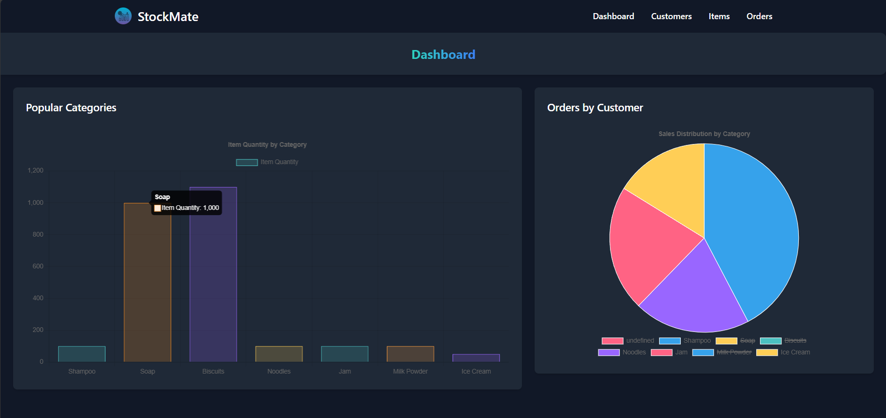
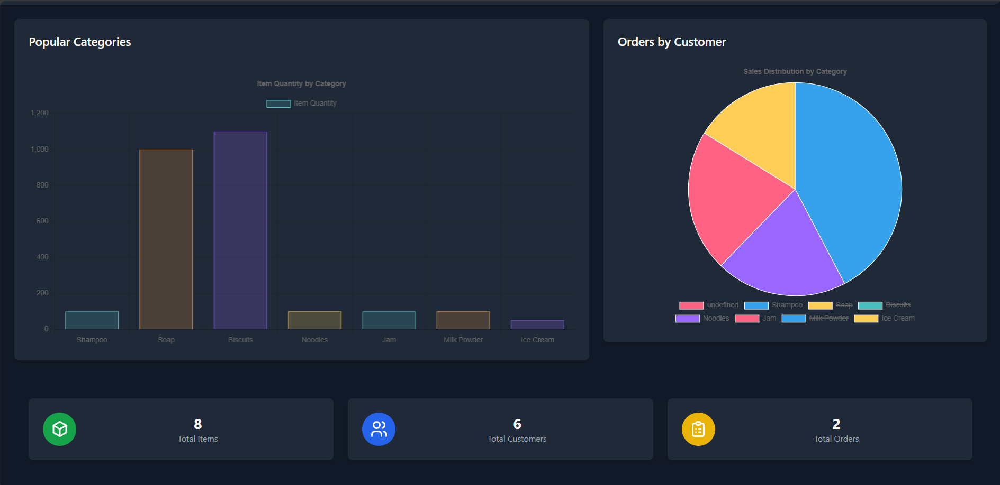
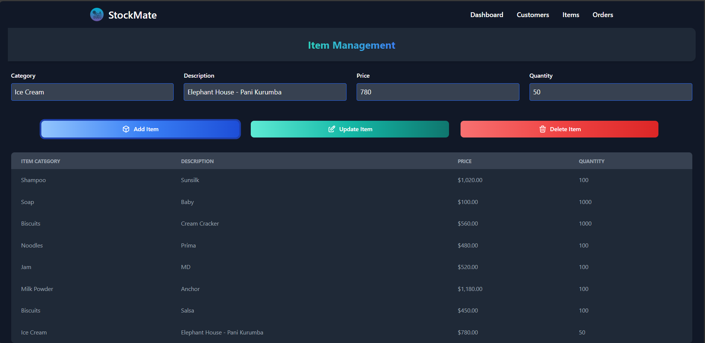
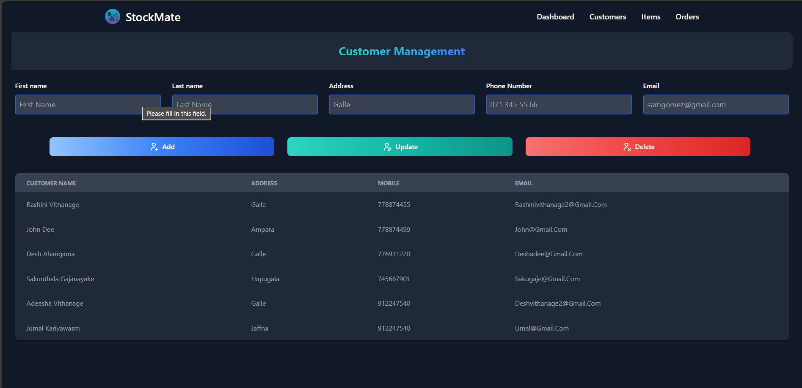
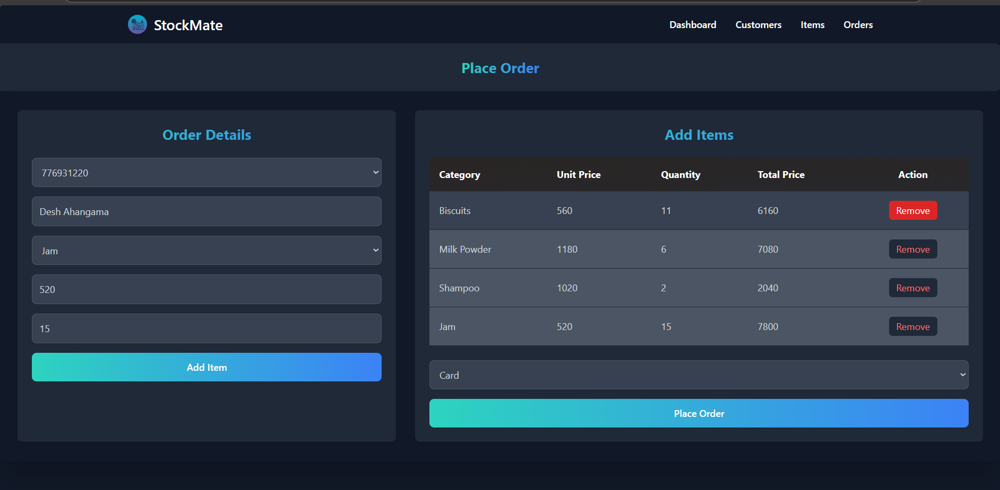

# StockMate Web Application 📚🔔

**Overview**  

StockMate is an intuitive and efficient inventory management system designed to help businesses track, organize, and manage their stock seamlessly. Whether you're handling a small retail shop or a large-scale warehouse, StockMate simplifies stock control, ensuring accurate inventory levels and smooth operations. 🚀📦  

---

## License

This project is licensed under the MIT License. For more information, view the LICENSE file.

## Screenshots

### Dashboard

### Item Management

### Customer Management

### Place-Order 

